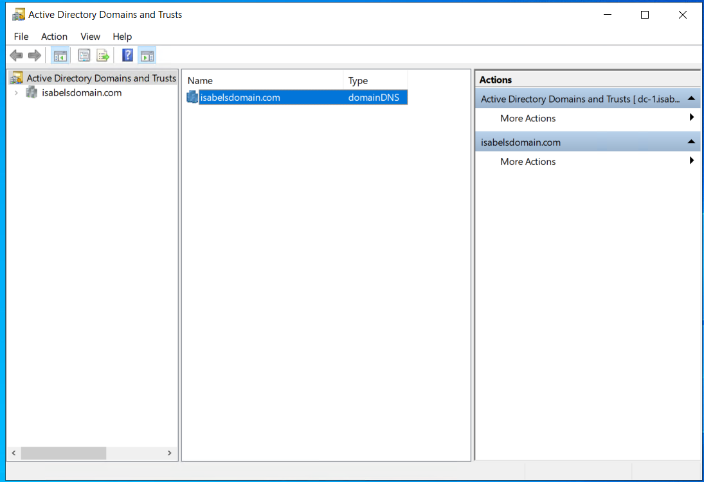
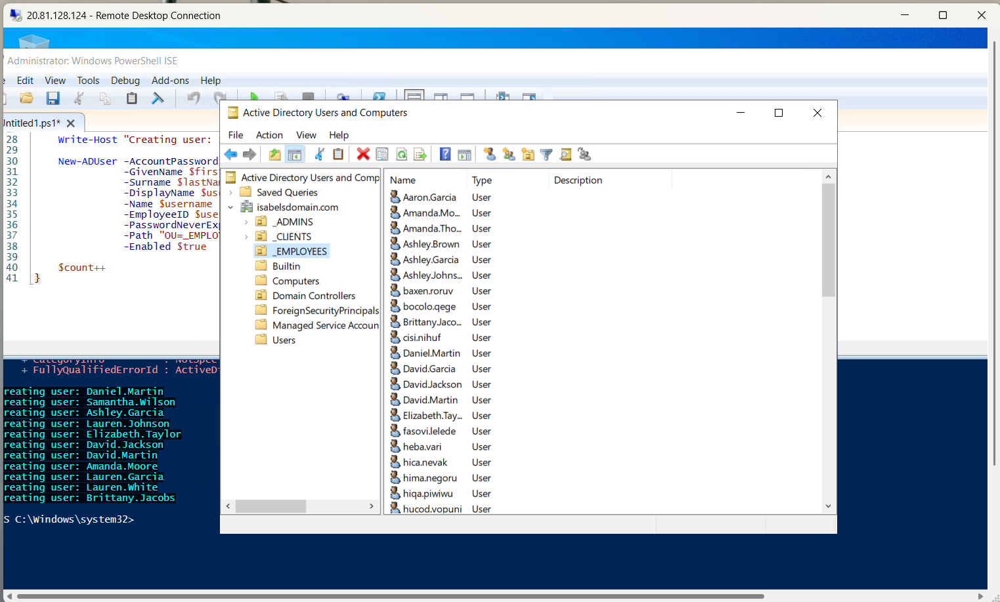
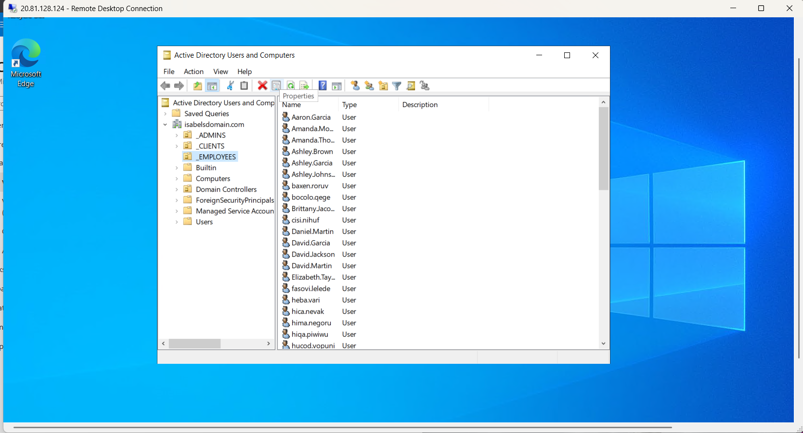
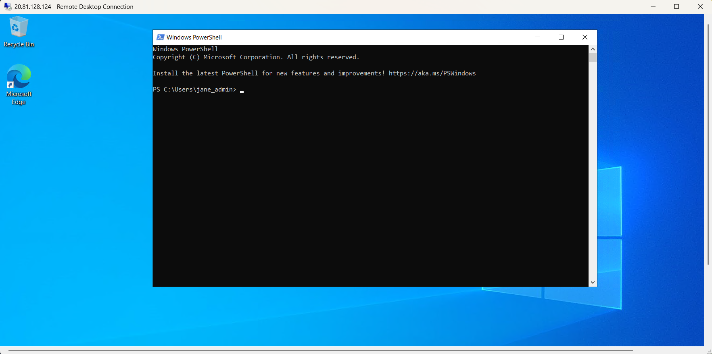
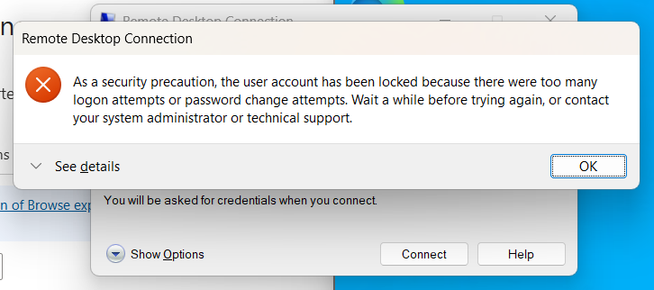
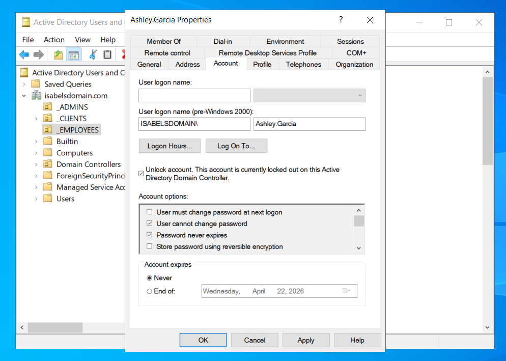
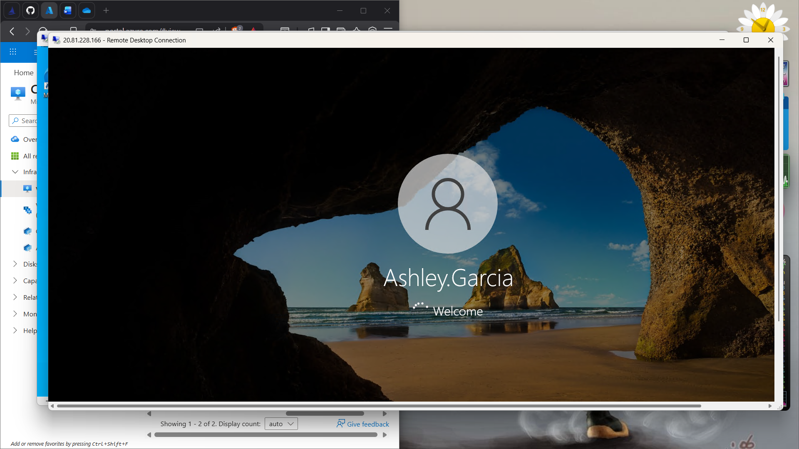
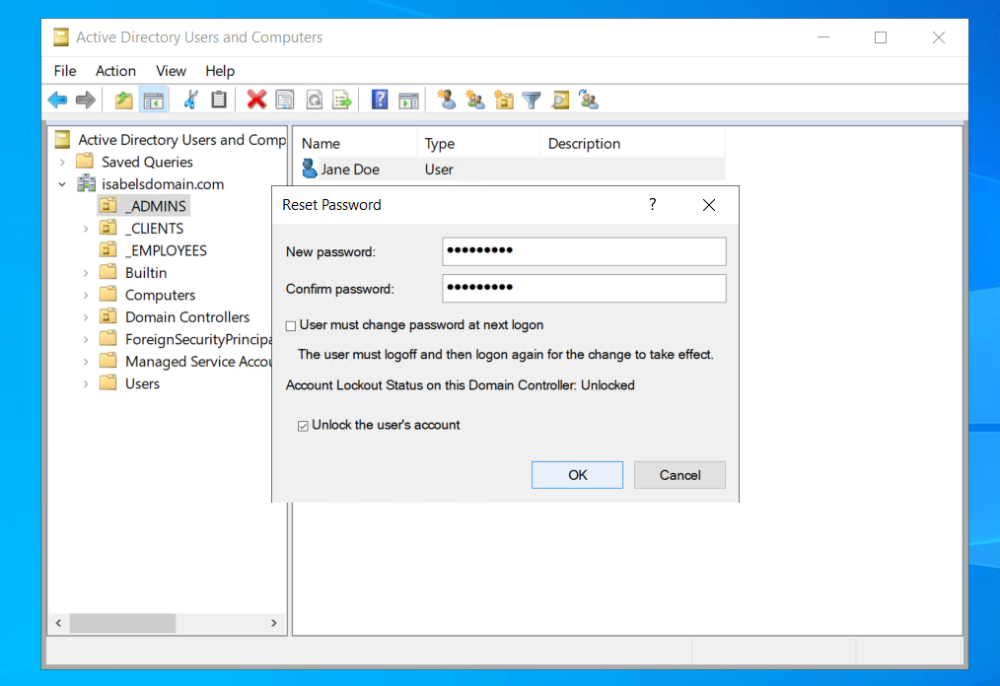
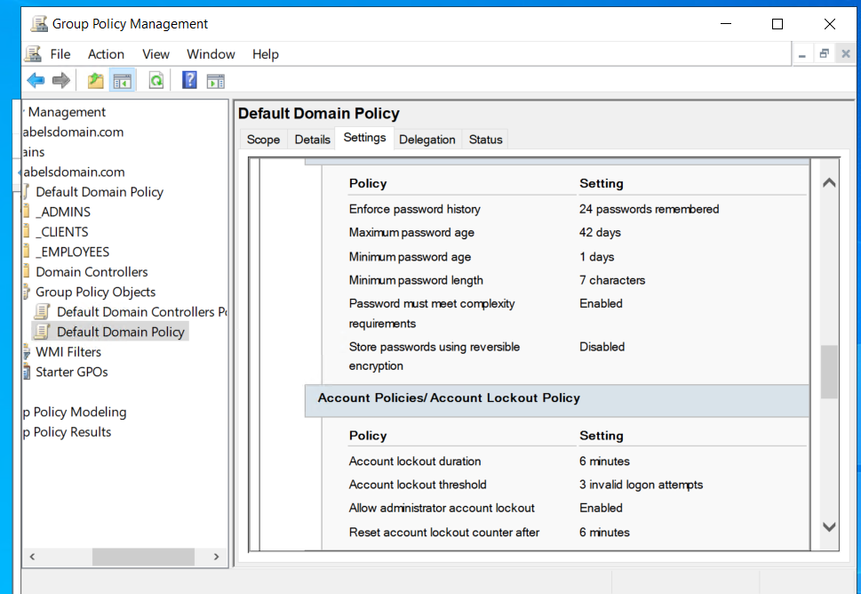
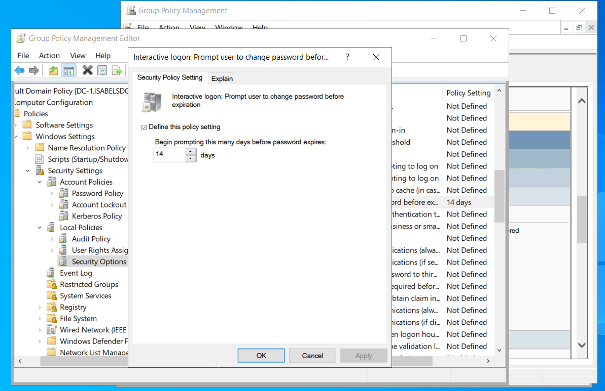

  
 

# 📁 Active Directory Account Management & Security Policy Enforcement

---

## 🔹Project Overview
#### This project demonstrates hands on implementation of user account management and security policy enforcement within an Active Directory environment using Windows Server.
#### Core administrative tasks included configuring account lockout policies through Group Policy, managing user account states, and resolving authentication-related incidents such as account lockouts and credential resets. This project simulates real world Active Directory administration tasks performed in enterprise IT environments, particularly in Help Desk and Junior System Administration roles.

- ### Technologies and Tools:
    - Active Directory Domain Services (AD DS)
    - Group Policy Management Console (GPMC)
    - Active Directory Users and Computers (ADUC)
    - Microsoft Azure (Virtual Machine Hosting)  
    - Windows Server 2022
    - Windows 10
    - Remote Desktop Protocol (RDP)
    - PowerShell ISE (Used to execute and modify scripts for automated user provisioning)
#### This project reflects real world IT operations commonly performed in Help Desk and Junior System Administration roles, particularly in managing user access and enforcing security policies within a domain environment. 
---

## 🔹Objectives
- Implement account lockout policies to control failed authentication attempts
- Simulate and analyze account lockout behavior from the Client side
- Perform account recovery through unlocking and password resets
- Manage account states (enable/disable) within Active Directory
- Understand the relationship between Group Policy and authentication security 
---

## 🔹Environment Setup 
- Domain Controller: Windows Server 2022
- Client machine: Windows 10
- Configured a VNET that both computers are on.
- Installed Active Directory through Server Manager
- Created a Domain: isabelsdomain.com
  #### Adminstrative tools:
  - Group Policy Management Console (GPMC)
  - Active Directory Users & Computers (ADUC)
  - PowerShell ISE
---
## 🔹Domain Configuration
   - Promoted dc-1 to Domain Controller
   - Configured DNS
   - Ensured that Client-1 points to dc-1 for DNS

---

## 🔹User Creation
#### User accounts were created both manually and through automation.
   - Created administrative user account (Jane Doe)
   - Used PowerShell ISE to execute a script for bulk user creation within the _EMPLOYEE OU
   - Selected a generated user account for client testing (Ashley.Garcia)

  
#### Authentication testing 
  - Verified administrative login using isabelsdomain.com\jane_admin
  - Logged into Client-1 using isabelsdomain.com\Ashley.Garcia
  - Confirmed successful domain authentication

---
## 🔹 Account Lockout Policy
### Configured an account lockout policy using Group Policy to enhance security against unauthorized access attempts.
  -  Set lockout threshold to 3 failed login attempts
  -  Forced Group Policy update using gpupdate /force
  -  Triggered lockout by entering incorrect credentials
  -  Verified account lockout status in Active Directory
  -  Unlocked account and restored access

    

---

## 🔹 Account Recovery
### Simulated common help desk scenarios involving account access issues.
  - Disabled a user account in Active Directory
  - Verified login failure due to disabled account status
  - Re-enabled the account
  - Confirmed restored access through successful login

---

## 🔹 Account Management
### Active Directory was used to manage user account lifecycle and access control.
  - Reset user passwords
  - Enabled and disabled user accounts
  - Unlocked locked accounts
  - Managed user attributes and permissions

---

## 🔹Group Policy Configuration
### Configured domain level policies to enforce security and user restrictions.
  - Defined password policies (length, complexity, expiration)
  - Configured account lockout thresholds
  - Applied policies across the domain
### User Restrictions
  - Disabled user text file history on the Start Menu
  - Restricted screen background changes

    
#### Group Policy provides centralized control over user behavior and system security within the domain environment.
---
## 🔹Key Takeaways
- Group Policy provides centralized control over domain wide security configurations
- Account lockout policies are critical for mitigating unauthorized access attempts
- Active Directory enables efficient user account managment and access control
- Troubleshooting authentication issues requires both system knowledge and structured analysis 
---
